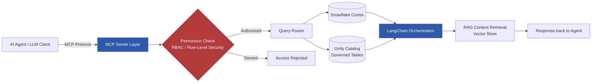

# AI-Agent-Ready Data Platform (MCP + RAG Access Patterns)


A demonstration platform that exposes governed enterprise data to **AI agents and LLMs** through the **Model Context Protocol (MCP)**, replacing traditional dashboard/SQL access with permission-aware, natural-language query interfaces — while preserving RBAC and row-level security.

> **Note:** This is a synthetic, standalone rebuild of an architecture pattern I designed and implemented in production for enterprise healthcare data platforms. All data, credentials, and infrastructure in this repo are demo-only — no proprietary or employer data is included.

---

## 📌 The Problem

Enterprise data consumers increasingly want AI agents and LLM-based copilots to query governed datasets directly — without a human writing SQL or opening a BI dashboard first. But doing this safely requires:

- Preserving existing **RBAC / row-level security** so an AI agent can't see data a human user couldn't
- Giving the LLM enough **schema and business context** to write correct, safe queries
- Keeping a **standard, interoperable interface** rather than a one-off integration per data source

This project solves that using MCP as the standardized "USB-C port" between AI agents and governed data.

---

## 🏗️ Architecture



**Flow summary:**
1. An AI agent (Claude, GPT, or any MCP-compatible client) sends a natural-language request via MCP.
2. The MCP server layer authenticates the request and checks it against existing RBAC / row-level security policies — the agent never bypasses governance that already applies to human users.
3. Authorized requests are routed to Snowflake Cortex and/or Unity Catalog-governed tables.
4. LangChain orchestrates retrieval-augmented context (RAG) from a vector store to ground the agent's answer in accurate, permissioned data.
5. A structured, policy-compliant response is returned to the agent.

---

## 🧰 Tech Stack

| Layer | Technology |
|---|---|
| Agent Protocol | Model Context Protocol (MCP) |
| Orchestration | LangChain, LangGraph |
| LLM Data Access | Snowflake Cortex |
| Governance | Unity Catalog, RBAC, Row-Level Security |
| Vector Store | Pinecone / FAISS |
| Embeddings | HuggingFace Transformers |
| Infra | Docker, Python 3.11 |

---

## 📁 Repository Structure

```
ai-agent-mcp-rag-platform/
├── mcp_server/
│   ├── server.py              # MCP server entrypoint
│   ├── auth/
│   │   └── rbac_middleware.py # Permission-check layer
│   └── router/
│       └── query_router.py    # Routes requests to Snowflake/Unity Catalog
├── rag/
│   ├── embeddings.py          # HuggingFace embedding pipeline
│   ├── vector_store.py        # FAISS/Pinecone integration
│   └── retriever.py           # LangChain RAG retrieval chain
├── data/
│   └── synthetic_dataset.csv  # Fake, non-proprietary sample data
├── docs/
│   └── architecture.png       # Exported architecture diagram
├── docker-compose.yml
├── requirements.txt
└── README.md
```

---

## 🚀 Quick Start

```bash
# Clone the repo
git clone https://github.com/saadalam690/ai-agent-mcp-rag-platform.git
cd ai-agent-mcp-rag-platform

# Build and run with Docker
docker-compose up --build

# The MCP server will be available at localhost:8080
```

---

## ✅ Outcome (Production Pattern)

In the production version of this pattern, this architecture:
- Enabled multiple business teams to query governed data through AI-agent interfaces without direct SQL access
- Reduced ad-hoc analytics requests to the central data team
- Preserved full governance/audit compliance since every AI-agent query passed through the same RBAC layer as human users

---

## 👤 Author

**Saad Alam Khan** — Principal Data Engineer | Data & Cloud Architect
[Portfolio](https://saadalam690.github.io/portfolio) · [LinkedIn](#) · [Email](mailto:saadalamkhan690@gmail.com)

---

## 📄 License

MIT License — this repository is a demonstration/portfolio project using synthetic data only.
